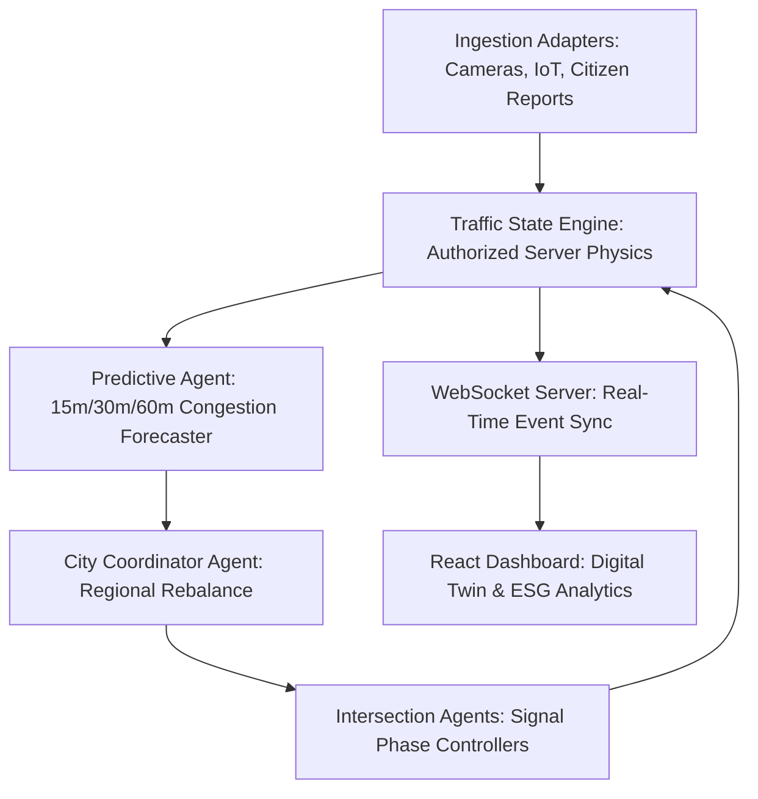

# SynapseCity AI - Autonomous Traffic Intelligence Grid

SynapseCity AI is a digital twin platform designed for real-time traffic signal optimization, V2X priority coordination, and multi-agent AI path detours.

---

## 1. System Architecture



- **Traffic State Engine**: authoritative server-side physics engine maintaining speed vectors, approach density penalties, and queues.
- **Agent Coordinator Mesh**: Distributed AI agents optimizing signals based on local intersection loads and weather configurations.
- **Dynamic Routing & Detours**: Route agents compute detours automatically to navigate vehicles around active incidents.
- **Preemptionwaves (Green Corridors)**: V2X emergency beacons automatically locks cyan waves along upcoming path nodes, restoring signal timings once passed.

---

## 2. Local Setup & Configuration

### Prerequisites
- Node.js (v18+)
- npm

### Installation
1. Clone the repository and navigate to the directory:
   ```bash
   npm install
   ```

2. Configure environment variables in `.env` (copied from `.env.example`):
   ```ini
   PORT=3000
   GEMINI_API_KEY=your_gemini_api_key_here
   ```

---

## 3. Operations Commands

### Development Server
Starts the Express server on port 3000 and the Vite hot-reloading client:
```bash
npm run dev
```

### Run Tests
Executes the full test suite verifying state engines, agent event bus triggers, and digital twin state machines:
```bash
npm run test
```

### Static Typecheck
Runs compiler check:
```bash
npm run lint
```

### Production Build
Bundles the React client and compile the server bundle to `dist/server.cjs`:
```bash
npm run build
```

---

## 4. Production Deployment

### Docker Container (Cloud Run ready)
Build and run the container locally:
```bash
# Build
docker build -t synapse-city-ai .

# Run
docker run -p 3000:3000 --env-file .env synapse-city-ai
```

Deploy to Google Cloud Run:
```bash
gcloud run deploy synapse-city-ai --source . --port 3000 --allow-unauthenticated
```
