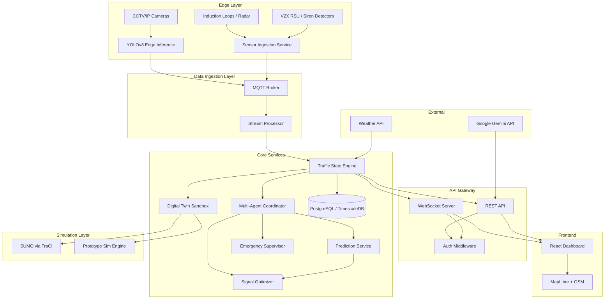
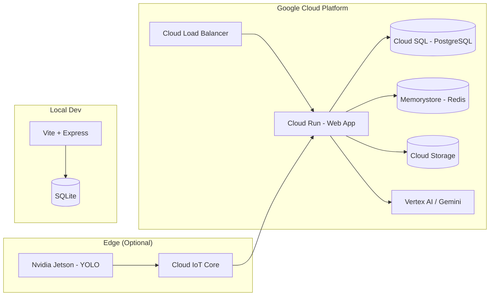

# Target Architecture Blueprint
## SynapseCity AI — Production-Grade System for Vellore, Tamil Nadu

---

## 1. Architecture Overview



---

## 2. Component Architecture

### 2.1 Frontend (React SPA)

| Component | Current | Target |
|:---|:---|:---|
| **Framework** | React 19 + Vite 6 | React 19 + Vite 6 *(keep)* |
| **State** | 15+ useState hooks in App.tsx | Zustand store with slices |
| **Map** | SVG synthetic grid | MapLibre GL JS + OpenStreetMap |
| **Styling** | Tailwind CSS v4 | Tailwind CSS v4 *(keep)* |
| **Font** | Satoshi via CDN | Satoshi self-hosted + CDN fallback |
| **Real-time** | WebSocket (full state broadcast) | WebSocket (delta updates) |
| **Routing** | React Router v7 | React Router v7 *(keep)* |
| **Charts** | Custom CSS bars | Recharts or Chart.js |
| **Testing** | None | Vitest + React Testing Library |
| **Accessibility** | None | WCAG 2.1 AA compliance |

### 2.2 Backend Services

| Service | Current | Target |
|:---|:---|:---|
| **Server** | Single Express server.ts | Express + service layer decomposition |
| **Traffic Engine** | Monolithic TrafficEngine class | Separated: EngineCore + AgentCoordinator + SimRunner |
| **Database** | None (in-memory) | PostgreSQL with TimescaleDB extension |
| **ORM** | None | Drizzle ORM |
| **Auth** | None | JWT + OAuth2 (Google) |
| **API** | WebSocket only | REST API + WebSocket (dual) |
| **Validation** | None | Zod schema validation |
| **Logging** | console.log | Pino structured logging |
| **Monitoring** | None | OpenTelemetry + Prometheus metrics |

### 2.3 AI/ML Pipeline

| Component | Current | Target Phase 1 | Target Phase 2 |
|:---|:---|:---|:---|
| **Decision Provider** | DeterministicDecisionProvider | Enhanced heuristic + Gemini evaluation | Custom RL model (PPO/DQN) |
| **Prediction** | Linear arithmetic | ARIMA / Prophet time series | LSTM / GCN spatial-temporal |
| **Computer Vision** | None | YOLOv8-nano inference on saved frames | Real-time RTSP + YOLOv8 |
| **Agent Logic** | Empty process() methods | Rule-based multi-agent coordination | MARL (Multi-Agent RL) |

### 2.4 Simulation Layer

| Component | Current | Target |
|:---|:---|:---|
| **Prototype Engine** | PrototypeSimulationEngine | Keep as fallback |
| **SUMO** | Placeholder class | SUMO 1.20 + TraCI Python bridge |
| **Network File** | None | Vellore `.net.xml` from OpenStreetMap |
| **Demand File** | None | Generated `.rou.xml` from traffic surveys |
| **Strategy Comparison** | Fake (hardcoded formulas) | Two SUMO instances (baseline + AI) |

---

## 3. Database Schema (Target)

```sql
-- Core entities
CREATE TABLE intersections (
    id UUID PRIMARY KEY,
    name VARCHAR NOT NULL,
    district VARCHAR NOT NULL,
    latitude DECIMAL(10, 7) NOT NULL,
    longitude DECIMAL(10, 7) NOT NULL,
    signal_mode VARCHAR NOT NULL DEFAULT 'autonomous_ai',
    created_at TIMESTAMPTZ DEFAULT NOW()
);

-- Time-series traffic data (TimescaleDB hypertable)
CREATE TABLE traffic_readings (
    time TIMESTAMPTZ NOT NULL,
    intersection_id UUID REFERENCES intersections(id),
    vehicle_count INT,
    queue_length INT,
    density_score DECIMAL(5,2),
    avg_speed_kmh DECIMAL(5,1),
    ns_density INT,
    ew_density INT,
    pedestrian_count INT,
    signal_phase VARCHAR,
    phase_remaining INT
);
SELECT create_hypertable('traffic_readings', 'time');

-- Incidents with persistence
CREATE TABLE incidents (
    id UUID PRIMARY KEY DEFAULT gen_random_uuid(),
    title VARCHAR NOT NULL,
    location VARCHAR NOT NULL,
    intersection_id UUID REFERENCES intersections(id),
    severity VARCHAR NOT NULL,
    category VARCHAR NOT NULL,
    status VARCHAR NOT NULL DEFAULT 'reported',
    ai_action TEXT,
    impact_delay_minutes DECIMAL(4,1),
    reported_at TIMESTAMPTZ DEFAULT NOW(),
    resolved_at TIMESTAMPTZ
);

-- Citizen reports
CREATE TABLE citizen_reports (
    id UUID PRIMARY KEY DEFAULT gen_random_uuid(),
    report_number VARCHAR UNIQUE NOT NULL,
    category VARCHAR NOT NULL,
    location_name VARCHAR NOT NULL,
    description TEXT NOT NULL,
    citizen_name VARCHAR NOT NULL,
    status VARCHAR NOT NULL DEFAULT 'pending',
    ai_confidence DECIMAL(5,2),
    upvotes INT DEFAULT 0,
    incident_id UUID REFERENCES incidents(id),
    submitted_at TIMESTAMPTZ DEFAULT NOW()
);

-- Simulation runs
CREATE TABLE simulation_runs (
    id UUID PRIMARY KEY DEFAULT gen_random_uuid(),
    strategy VARCHAR NOT NULL,
    config JSONB NOT NULL,
    results JSONB NOT NULL,
    engine VARCHAR NOT NULL,
    created_at TIMESTAMPTZ DEFAULT NOW()
);

-- Emergency dispatches
CREATE TABLE emergency_dispatches (
    id UUID PRIMARY KEY DEFAULT gen_random_uuid(),
    callsign VARCHAR NOT NULL,
    type VARCHAR NOT NULL,
    origin_intersection_id UUID REFERENCES intersections(id),
    destination_intersection_id UUID REFERENCES intersections(id),
    path_node_ids UUID[] NOT NULL,
    status VARCHAR NOT NULL DEFAULT 'dispatching',
    eta_seconds INT,
    time_saved_seconds INT,
    dispatched_at TIMESTAMPTZ DEFAULT NOW(),
    arrived_at TIMESTAMPTZ
);
```

---

## 4. API Architecture (Target)

### REST Endpoints

| Method | Path | Purpose | Auth |
|:---|:---|:---|:---|
| GET | `/api/health` | Health check | Public |
| POST | `/api/auth/login` | JWT login | Public |
| GET | `/api/intersections` | List intersections | User |
| GET | `/api/intersections/:id` | Get intersection detail | User |
| PUT | `/api/intersections/:id/mode` | Change signal mode | Operator |
| POST | `/api/emergency/dispatch` | Dispatch emergency | Operator |
| DELETE | `/api/emergency/:id` | Clear emergency | Operator |
| GET | `/api/incidents` | List incidents | User |
| POST | `/api/incidents/:id/resolve` | Resolve incident | Operator |
| POST | `/api/citizen-reports` | Submit citizen report | Public |
| GET | `/api/citizen-reports` | List reports | User |
| GET | `/api/analytics/history` | Historical data | User |
| POST | `/api/simulation/save` | Save simulation run | Operator |
| POST | `/api/gemini/analyze` | AI copilot query | User |

### WebSocket Events

| Direction | Event | Payload | Auth |
|:---|:---|:---|:---|
| Server → Client | `state.delta` | Only changed properties | User |
| Server → Client | `emergency.update` | Emergency vehicle position | User |
| Server → Client | `agent.log` | New agent log entry | User |
| Client → Server | `signal.mode` | `{ nodeId, mode }` | Operator |
| Client → Server | `signal.rebalance` | `{ nodeId }` | Operator |
| Client → Server | `sim.config` | `{ config partial }` | Operator |

---

## 5. Deployment Architecture (Target)



---

## 6. Migration Path from Current to Target

### Phase 1: Foundation (2-3 weeks)
- Add PostgreSQL + Drizzle ORM
- Migrate simulation history from file to database
- Add authentication (JWT)
- Replace mph with km/h throughout
- Replace Western mock data with Vellore intersections
- Add Indian vehicle types to simulation
- Self-host Satoshi font files
- Add Zustand state management

### Phase 2: Core Intelligence (3-4 weeks)
- Implement genuine prediction heuristics (honestly labeled)
- Fill agent `process()` methods with meaningful rule-based logic
- Implement real baseline vs AI comparison (separate engine instances)
- Integrate MapLibre + OpenStreetMap
- Add REST API alongside WebSocket
- Implement WebSocket delta updates

### Phase 3: AI Integration (4-6 weeks)
- Integrate YOLOv8 for frame-by-frame vehicle detection
- Implement ARIMA/Prophet time-series predictions
- Connect Gemini for traffic decision evaluation
- Add SUMO via TraCI for validated simulation
- Implement signal safety constraints (NEMA-style)

### Phase 4: Production Hardening (2-3 weeks)
- Add comprehensive testing (Vitest + Playwright)
- Add monitoring (OpenTelemetry)
- Add rate limiting + input validation
- WCAG 2.1 AA accessibility
- Performance optimization (delta updates, lazy loading)
- Cloud Run deployment with CI/CD
