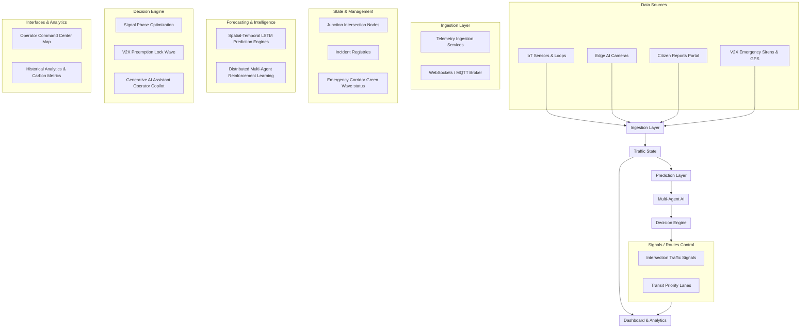

# SynapseCity AI Data Flow Diagram

This document illustrates the pipeline of city traffic telemetry and decision-making logic inside the SynapseCity AI metropolitan operating system.

---

## Data Pipeline Details

1.  **Data Sources**: Detections occur at the edge (edge cameras classifying traffic classes; GPS transmitters signaling ambulance paths; citizens submitting pothole locations).
2.  **Ingestion Layer**: Ingests traffic indicators via lightweight message brokers (MQTT/WebSockets).
3.  **Traffic State**: Reconstructs the grid (represented as connected nodes in the city map, incidents list, and camera speed violations status).
4.  **Prediction**: Evaluates risk profiles (LSTM networks forecasting queue buildups 15m, 30m, and 60m into the future).
5.  **Multi-Agent AI**: Intersection nodes function as collaborative agents. Nearby nodes exchange density metrics to negotiate phase timings before bottlenecking occurs.
6.  **Decision Engine**: Outputs green/yellow/red durations, triggers emergency green lock overrides, or interacts with operators via the Gemini AI Copilot interface.
7.  **Signals & Output**: Dispatches command calls directly to physical road junction signals and AV lanes.
8.  **Dashboard & Analytics**: Updates UI maps, performance grades (LOS), carbon savings, and logs in real-time.
