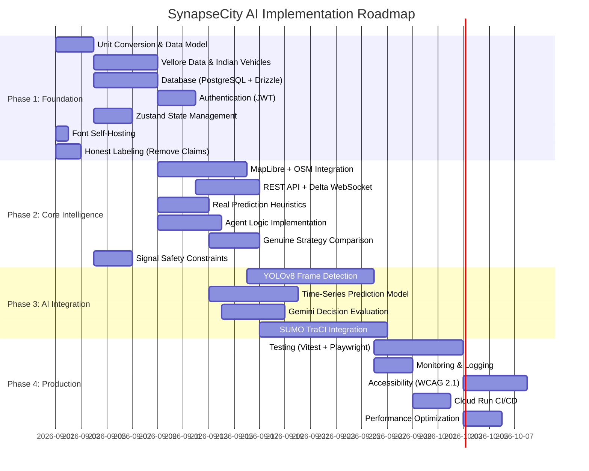

# Phased Implementation Plan
## SynapseCity AI — From Prototype to Production

---

## Phase Overview

---

## Phase 1: Foundation Integrity (Weeks 1-3)

> **Goal:** Make every claim honest, every unit correct, every feature genuine.

### 1.1 Honest Labeling (P0)

| Task | Files | Description |
|:---|:---|:---|
| Remove "LSTM FORECAST (96.4% ACC)" | `PredictionsPage.tsx` | Replace with "HEURISTIC FORECAST" or "RULE-BASED PREDICTION" |
| Remove "4K VISION (60 FPS)" | `LiveTrafficPage.tsx` | Replace with "SIMULATED FEEDS" or remove badge |
| Remove "PPO RL agent" | `ArchitecturePage.tsx` | Replace with "Rule-Based Decision Agent" |
| Remove "GCN + LSTM" | `ArchitecturePage.tsx`, `PredictionsPage.tsx` | Replace with "Statistical Heuristic Model" |
| Remove "V2X siren triangulation" | `EmergencyCommandPage.tsx` | Replace with "GPS-Based Green Corridor" |
| Remove "142 Edge AI Nodes" | `LandingPage.tsx`, `Sidebar.tsx` | Replace with actual node count |
| Remove "14,850+ Vehicles" | `LandingPage.tsx` | Replace with actual sim vehicle count |
| Update "reinforcement learning" | Multiple pages | Replace with "heuristic optimization" |

### 1.2 Unit Conversion (P0)

| Change | Scope |
|:---|:---|
| `avgSpeedMph` → `avgSpeedKmh` | `types.ts`, `mockData.ts`, all UI components, `routingEngine.ts`, `simulationEngine.ts` |
| Speed values × 1.609 | All hardcoded speed values |
| "mph" labels → "km/h" | `OverviewDashboard.tsx`, `LiveTrafficPage.tsx`, `ComputerVisionView.tsx` |
| `baseSpeedMps = 15` → recalculate | `routingEngine.ts:104` |

### 1.3 Vellore Data Model (P1)

| Task | Details |
|:---|:---|
| Replace 8 Western intersections | Create 8 Vellore intersections with lat/lng |
| Replace district names | "Downtown Financial Core" → "Katpadi", "Sathuvachari", etc. |
| Replace road names | "5th Ave & Grand Blvd" → "Katpadi Main Road & NH48" |
| Replace camera feed titles | Update to Vellore-relevant camera locations |
| Add `latitude`, `longitude` to IntersectionNode | For MapLibre integration |
| Add `roadWidth`, `intersectionType` fields | For realistic capacity modeling |

### 1.4 Indian Vehicle Types (P1)

| Task | Details |
|:---|:---|
| Add `motorcycle`, `auto_rickshaw`, `scooter`, `bicycle` to VehicleType | `types.ts` |
| Create VehicleBehavior config per type | Lane splitting, signal compliance, effective width |
| Update vehicle generation in TrafficEngine | 45-55% motorcycles, 10-15% auto-rickshaws |
| Update ComputerVisionView detections | Show Indian vehicle classes |
| Update vehicle table in LiveTrafficPage | Correct vehicle distribution |

### 1.5 Database Foundation (P1)

| Task | Details |
|:---|:---|
| Install PostgreSQL + Drizzle ORM | `npm install drizzle-orm pg` |
| Create schema (intersections, incidents, reports, runs) | Per ARCHITECTURE_TARGET schema |
| Migrate simulation_history.json → database | SimulationHistory class reads/writes to DB |
| Persist citizen reports | POST route writes to DB, GET reads from DB |
| Persist incidents | Create/resolve writes to DB |

### 1.6 Authentication (P1)

| Task | Details |
|:---|:---|
| JWT authentication middleware | Express middleware for REST endpoints |
| WebSocket authentication | Token-based handshake on WS connect |
| User roles: `public`, `user`, `operator`, `admin` | Different access levels |
| Login page (simple) | JWT login form |

### 1.7 State Management (P2)

| Task | Details |
|:---|:---|
| Install Zustand | Replace 15+ useState hooks in App.tsx |
| Create store slices | `trafficStore`, `emergencyStore`, `simConfigStore` |
| Connect WebSocket to store | Single store subscription |
| Remove prop drilling | Pages read from store directly |

### 1.8 Font Self-Hosting (P2)

| Task | Details |
|:---|:---|
| Download Satoshi font files | WOFF2 format (300, 400, 500, 700, 800, 900) |
| Place in `public/fonts/` | Local file serving |
| Update CSS @font-face | Local source with CDN fallback |

---

## Phase 2: Core Intelligence (Weeks 4-6)

> **Goal:** Replace mocks with real logic, add genuine intelligence.

### 2.1 MapLibre + OpenStreetMap

| Task | Details |
|:---|:---|
| Install MapLibre GL JS | `npm install maplibre-gl` |
| Create VelloreMap component | Replace CityMap.tsx SVG |
| Plot intersections with markers | lat/lng from Vellore data |
| Draw road connections | GeoJSON LineStrings between intersections |
| Vehicle animation on map | Move vehicle markers along road geometry |
| Emergency corridor visualization | Highlight route on map |

### 2.2 REST API + Delta WebSocket

| Task | Details |
|:---|:---|
| Create REST routes per ARCHITECTURE_TARGET | CRUD for intersections, incidents, reports |
| Implement Zod validation | Schema validation on all inputs |
| Implement delta updates | Only send changed fields via WebSocket |
| Rate limiting | Limit API and WebSocket message rate |

### 2.3 Real Prediction Heuristics

| Task | Details |
|:---|:---|
| Implement time-of-day baseline model | Peak hour multipliers based on Vellore patterns |
| Implement moving average prediction | Last 10 density readings → linear extrapolation |
| Label as "Statistical Heuristic" | Honest labeling |
| Store predictions in TimescaleDB | For accuracy validation |

### 2.4 Agent Logic Implementation

| Task | Details |
|:---|:---|
| CityCoordinatorAgent.process() | Evaluate citywide congestion balance, redistribute green time |
| EmergencyAgent.process() | Monitor emergency events, pre-position green waves |
| RouteAgent.process() | Calculate recommended detour routes |
| IncidentAgent.process() | Auto-detect congestion anomalies → create incidents |
| WeatherAgent.process() | Fetch weather data, adjust speed models |

### 2.5 Genuine Strategy Comparison

| Task | Details |
|:---|:---|
| Create two PrototypeSimulationEngine instances | Separate state for baseline vs AI |
| Baseline: Fixed cycle timing | 30s N-S, 30s E-W, no adaptation |
| AI: Full agent-driven optimization | Dynamic phase adjustment based on density |
| Compare metrics from each engine | Genuine avg delay, throughput, queue length |
| Remove hardcoded formula advantages | Delete `isAi ? ... : ...` pattern |

### 2.6 Signal Safety Constraints (P0)

| Task | Details |
|:---|:---|
| Minimum green time: 7 seconds | IRC standard |
| Maximum green time: 120 seconds | Prevent infinite green |
| All-red clearance interval: 2-4 seconds | Between conflicting phases |
| Yellow clearance: 3-5 seconds | Before red |
| Pedestrian minimum walk: 7 seconds | When ped signal exists |
| Conflict detection | Prevent two conflicting greens |

---

## Phase 3: AI Integration (Weeks 7-10)

> **Goal:** Add genuine ML/AI capabilities, honestly labeled.

### 3.1 YOLOv8 Vehicle Detection

| Task | Details |
|:---|:---|
| Train/fine-tune YOLOv8-nano | Indian vehicle dataset (motorcycle, auto-rickshaw, car, bus, truck) |
| Frame extraction from test videos | Process saved video frames (not real-time initially) |
| Detection API endpoint | POST image → return detections JSON |
| Connect to camera feed display | Show real detection counts |
| Annotated frame overlay | Draw bounding boxes on camera feed images |

### 3.2 Time-Series Prediction

| Task | Details |
|:---|:---|
| Implement ARIMA or Facebook Prophet | 15/30/60 min forecasts from historical data |
| Train on simulation-generated data | Until real data is available |
| Prediction accuracy tracking | Compare prediction vs actual |
| Label as "ARIMA/Prophet Model" | Honest labeling |

### 3.3 Gemini Decision Evaluation

| Task | Details |
|:---|:---|
| Use Gemini to evaluate agent decisions | Post-hoc evaluation, not real-time control |
| "Second opinion" on signal timing | Gemini analyzes current state and suggests improvements |
| Human-readable explanation | Show Gemini's reasoning in agent inspector |
| Cost-controlled | Cache responses, limit API calls |

### 3.4 SUMO TraCI Integration

| Task | Details |
|:---|:---|
| Generate Vellore .net.xml from OSM | `netconvert` tool |
| Generate traffic demand .rou.xml | From Vellore traffic surveys/estimates |
| Python TraCI bridge | WebSocket connection from Node.js to Python SUMO runner |
| Replace PrototypeSimulationEngine tick() | TraCI-driven simulation when SUMO available |
| SUMO-validated metrics | Real intersection delay, queue, throughput |

---

## Phase 4: Production Hardening (Weeks 11-13)

> **Goal:** Make the system robust, tested, and deployable.

### 4.1 Testing

| Category | Tool | Target |
|:---|:---|:---|
| Unit tests | Vitest | Services, utilities, type validation |
| Component tests | Vitest + React Testing Library | All page components |
| Integration tests | Vitest | WebSocket + API endpoints |
| E2E tests | Playwright | Critical user flows |
| Performance tests | Lighthouse CI | Core Web Vitals |

### 4.2 Monitoring

| Component | Tool |
|:---|:---|
| Structured logging | Pino |
| Metrics | OpenTelemetry + Prometheus |
| Error tracking | Sentry |
| Uptime monitoring | Cloud Monitoring |

### 4.3 Accessibility

| Standard | Target |
|:---|:---|
| WCAG 2.1 AA | All interactive elements |
| Keyboard navigation | Full application |
| Screen reader support | ARIA labels |
| Color contrast | 4.5:1 minimum |
| Focus management | Visible focus indicators |

### 4.4 Deployment

| Task | Details |
|:---|:---|
| Cloud Run deployment | Update Dockerfile with PostgreSQL |
| CI/CD pipeline | GitHub Actions → build → test → deploy |
| Environment management | Production, staging, development |
| Database migration system | Drizzle migrations |
| CDN for static assets | Cloud CDN or Cloudflare |

---

## Milestone Checkpoints

| Milestone | Week | Success Criteria |
|:---|:---|:---|
| **M1: Honest Foundation** | Week 2 | All false claims removed, units converted, Vellore data in place |
| **M2: Data Integrity** | Week 3 | Database operational, auth working, persistence verified |
| **M3: Real Map** | Week 5 | MapLibre rendering Vellore with live intersection markers |
| **M4: Genuine AI** | Week 6 | Real strategy comparison, agent logic implemented, safety constraints |
| **M5: Computer Vision** | Week 8 | YOLOv8 detecting Indian vehicles from saved frames |
| **M6: Prediction** | Week 9 | ARIMA/Prophet generating real forecasts from historical data |
| **M7: SUMO Validated** | Week 10 | SUMO running Vellore network, TraCI metrics feeding dashboard |
| **M8: Production Ready** | Week 13 | All tests passing, monitoring active, Cloud Run deployed |
